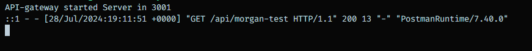

# Some Important npm packages note :

### `npm i morgan`

- HTTP request logger middleware for node.js.
- Morgan is an HTTP logging library for Node.js that can be used to log requests, errors, and more to the console.
- It's a popular middleware that's often used with Express.js, a web framework for Node.js.
- Morgan provides flexibility for customizing the format of log messages
- Morgan also allows users to specify which requests should be logged and which should be ignored.
- For example, users can log details about incoming HTTP requests such as the request method `[http , https]` , URL `[localhost,www.example.com]`, status code`[200,500,201,]`, and response time.

  

### `npm i express-rate-limit`

- Basic rate-limiting middleware for Express.
- Use to limit repeated requests to public APIs and/or endpoints such as password reset.
- Plays nice with express-slow-down and ratelimit-header-parser.
